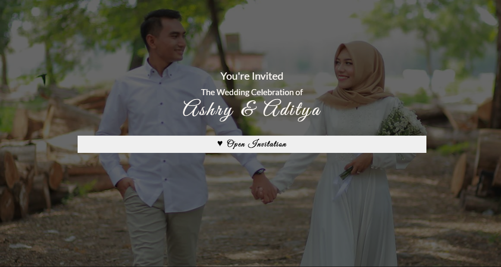

 
# Wedding Invitation Template
This is a wedding invitation web template built using HTML5, SCSS and javascript. 
**Check out [live preview](https://devvma.github.io/WebTemplates-WeddingInvitation/)**

## Feature
* Cover page
* Photo slider
* Navigation
* Smooth scroll to section
* Gmaps direction
* Event countdown
* Wishes form
* Slide up entrance effect

# :computer: What i learned
- [x] SCSS compiled with [koala](http://koala-app.com/)
- [x] Countdown counter
- [x] Scroll to section using jQuery
- [x] Show/hide navigation on scroll using jQuery
- [x] Built slider using Owl Caraousel
- [x] Slide up entrance animation using CSS transisiton
